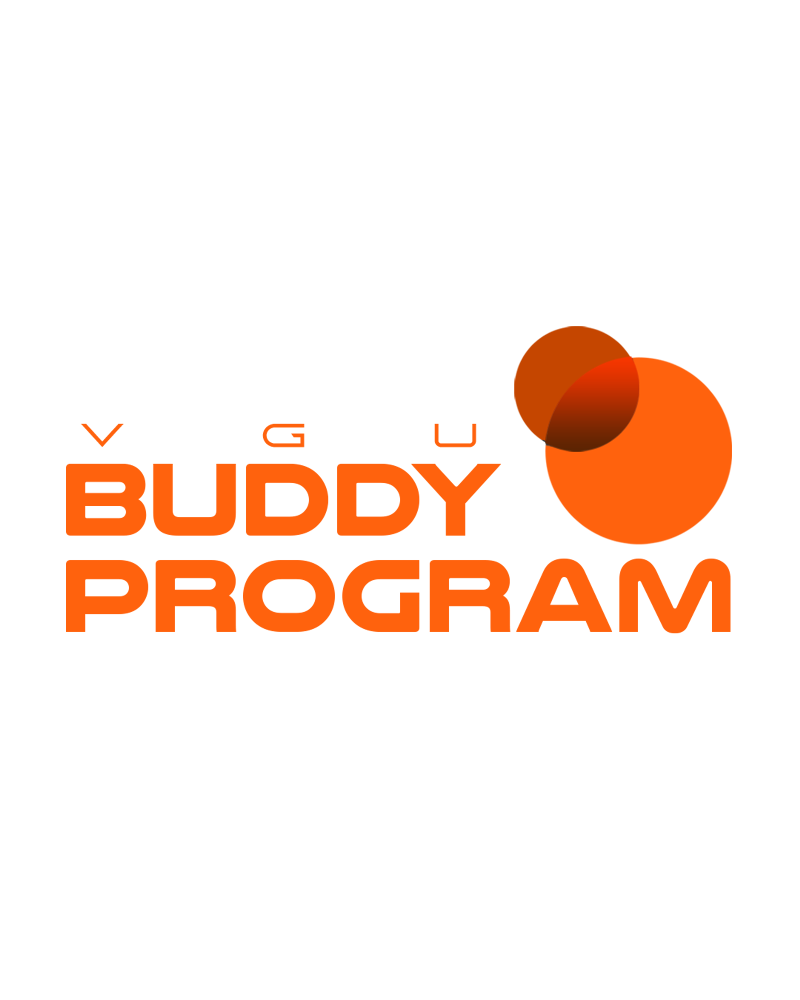

<h1 align="center">
  
   
  VGU Buddy Program Website
</h1>

  <em>Your gateway to an amazing Vietnamese-German University community experience.</em>  

  

  
  
  

---

## 🚀 Overview
Welcome to the **official website of the VGU Buddy Program** — a platform created to connect students and foster an inclusive, supportive, and engaging community at **Vietnamese-German University (VGU)**.  

It supports students **academically and socially** by providing connections, resources, and a touch of technology to make campus life smoother.

---

## 🛠️ Technologies Used
This project is built with **modern web technologies**:

| Technology | Purpose |
|-------------|----------|
| 🧱 **HTML** | Structure |
| ⚙️ **JavaScript** | Interactivity |
| 🎨 **CSS** | Base styling |
| 🌈 **TailwindCSS** | Modern, responsive, utility-first design |

---

## 🌐 Deployment
Hosted on **[Vercel](https://vercel.com)** for **fast, secure, and global access**.  
> 💡 Continuous deployment is enabled for seamless updates with every push.

---

## ✨ Key Features

### 🛍️ Merchandise Shop
Exclusive **VGU Buddy Program merch** with sleek product cards, hover animations, and responsive layouts — a stylish way to show your school spirit.

### 🎉 Events
Stay up-to-date with **cultural activities, workshops, and social gatherings**.  
Events are displayed in a **clean grid layout** with shadows and soft animations.

### 📘 Survival Book
A must-have guide for international students at VGU — **practical tips and essential info** styled with clear typography and accent highlights.

### 🏢 International Office Info
Find **key contacts and services** at the VGU International Office.  
Everything is formatted for **clarity, accessibility, and ease of reading**.

### 🤖 AI Chatbot – Virtual Buddy
Meet your **AI-powered Virtual Buddy** — a chatbot designed to assist you instantly with questions about university life and the Buddy Program.  
Built with a **friendly interface**, rounded corners, and modern accents.

---

## 💅 Modern Styling Highlights
✅ Built with **TailwindCSS utilities** for clean and flexible design  
✅ Generous **white space & padding** for a pleasant reading experience  
✅ **Smooth hover effects** and **soft transitions**  
✅ **Consistent color palette**: whites, soft blues, and bright accents  
✅ **Typography pairing** — serif for headings, sans-serif for body text  
✅ Buttons & cards with **rounded corners** and **subtle shadows**  
✅ Fully **responsive (mobile-first)** layout  
✅ **Dark/Light mode toggle** for modern accessibility

---

## 🌟 Vision
> This website is more than just a platform — it’s the **complete digital companion** for every VGU student.  
> Whether you're seeking connection, guidance, or just curiosity, the Buddy Program site helps you **thrive, connect, and belong**.

---

  © 2025 💻 <strong>DevCrew – VGU Buddy Program Team</strong>. All rights reserved.

